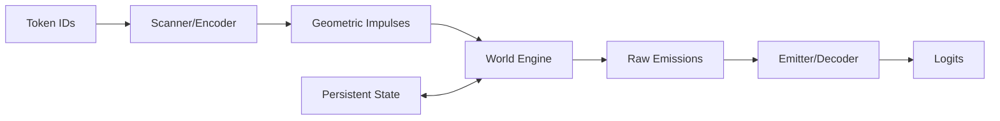

# ISN (Inertial State Network) Documentation

## Overview

The **Inertial State Network (ISN)** is a simulative realization of the GFN paradigm. Unlike statistical models that store context in a quadratic attention matrix, ISN treats sequence processing as the continuous evolution of a persistent latent world.

In ISN, information is "lived" by a state vector flowing through a geometric manifold. It achieves $O(1)$ memory complexity and constant-time per-token updates, making it uniquely efficient for long-range sequence modeling.

## Architecture at a Glance

The ISN implements a modular pipeline that decouples scanning, simulation, and materialization:



## Core Components

1.  **Scanner**: Projects discrete tokens into the geometric manifold as "impulses"—kinetic entries that perturb the world state.
2.  **World Engine**: The heart of the simulation. It evolves the persistent world state based on incoming impulses and internal physics (e.g., Hamiltonian flow).
3.  **Emitter**: Materializes the raw emissions from the latent world into discrete outcomes (e.g., probability distributions for the next token).

## Getting Started

### 1. Installation
Ensure you have the `gfn` framework installed:
```bash
pip install gfn
```

### 2. High-Level Usage
```python
from gfn.realizations.isn import Model, create_default_isn

# Create a model with default components
model = create_default_isn(vocab_size=50000, d_model=256)

# Forward pass (Full sequence)
output = model(input_ids)
logits = output['logits'] # [batch, seq, vocab]

# Stateful Generation (O(1) updates)
generated, info = model.generate(prompt_ids, max_length=100)
```

## Further Reading

- [Architecture & Physics](architecture.md) - How the internal world works.
- [Usage Guide](usage.md) - Detailed API and state handling.
- [Training Guide](training.md) - Losses, curriculums, and optimization.
